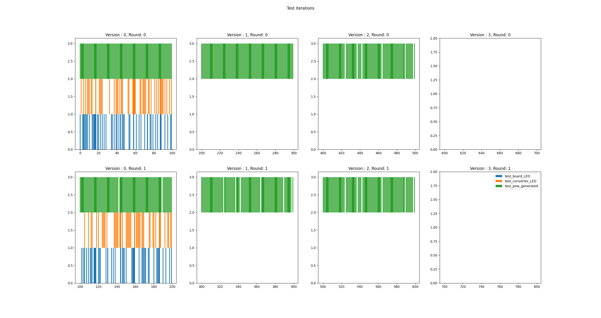
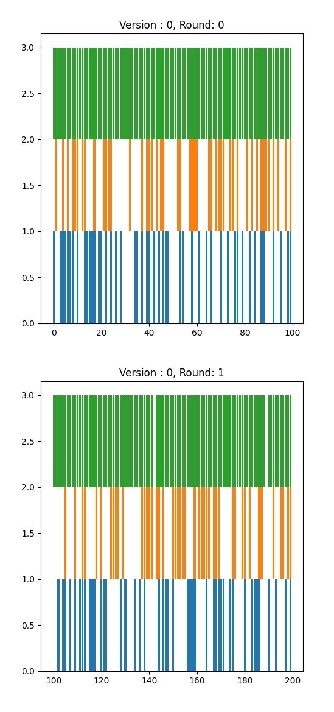
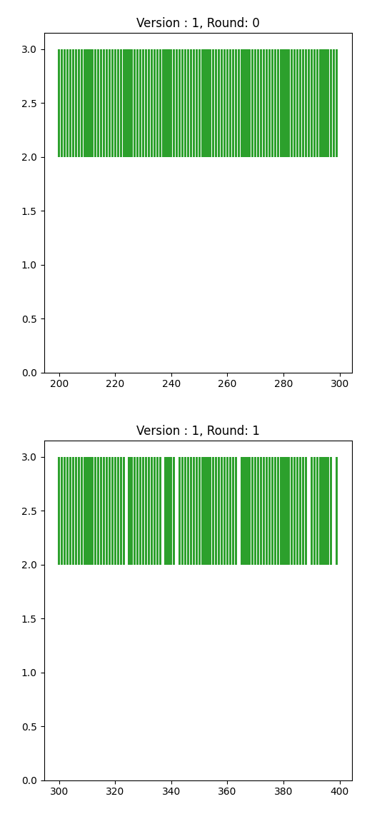
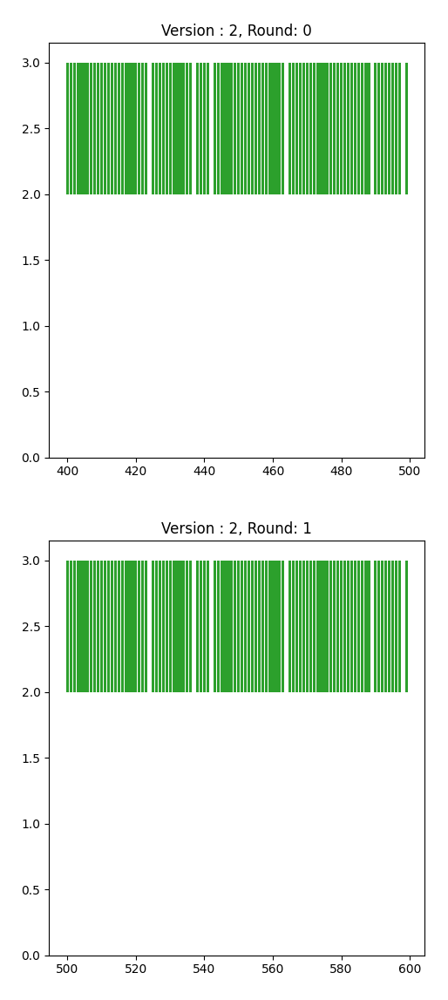
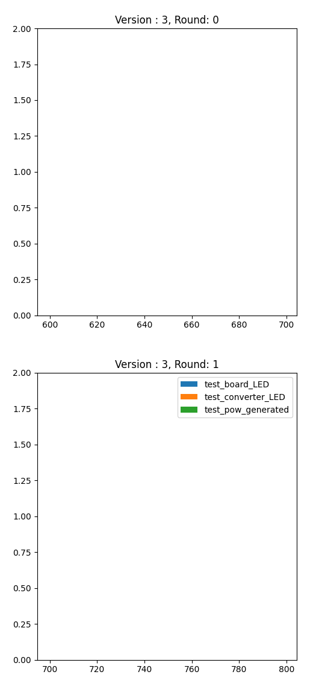

# Hydro Generator Presentation
## Summary
This code is meant to accompany the technical presentation on Hydro Generators. 

## Quick start:
`pytest --junitxml="result.xml"`

## How to use this code
Install all dependencies using the requirements file. It is highly recommended to do this in a Python3 virtual environment.
### Check simulation
You can test that the simulation is working by running `pytest test_simulation.py`. Passing tests indicate that the simulation is behaving accurately. You can also check the CircleCI tests for your latest commit.
### Check sample population
Run `pytest` to run the sample population through each version of tests, through 2 rounds of testing.
You can see a graphical representation of results by running `python plotresults.py`, which will graph all errors found for each device.

## Test Version: MVP
Specifically note failures like this:
`Failed: Power reading cannot be parsed`

## Test Version: 1
Note that the power generating failures are different based on the test round:

`0.02533117664907239 >= 20`

`assert 0.0 >= 20`

## Test Version: 2
These are now the only failures we're seeing:
`assert 0.02533117664907239 >= 20`
Note that we're also not seeing any changes between rounds 1 and 2.

## Test Version: 3
No failures

