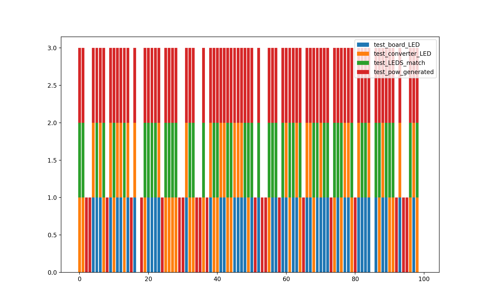
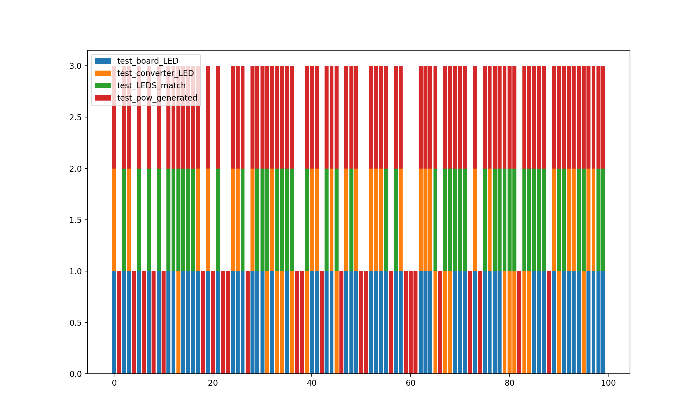
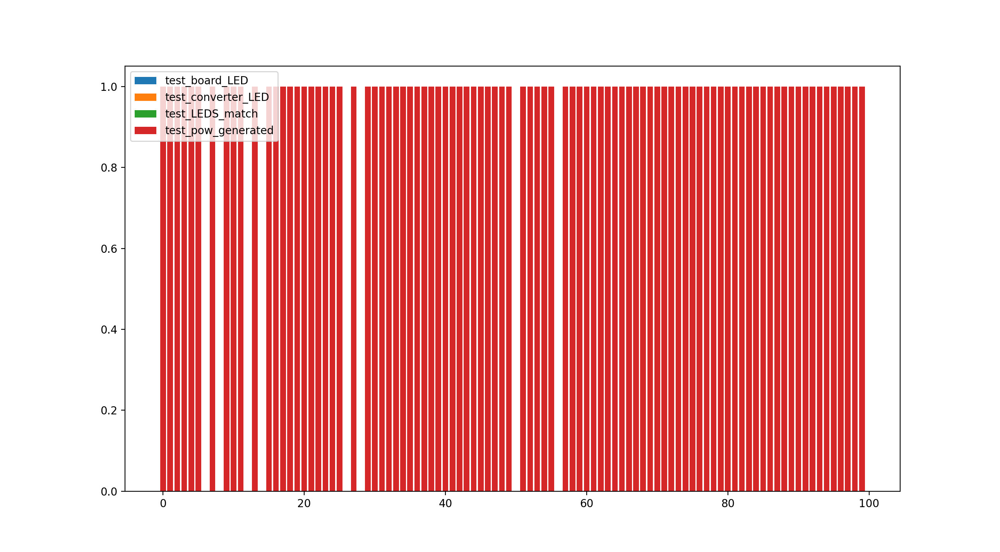
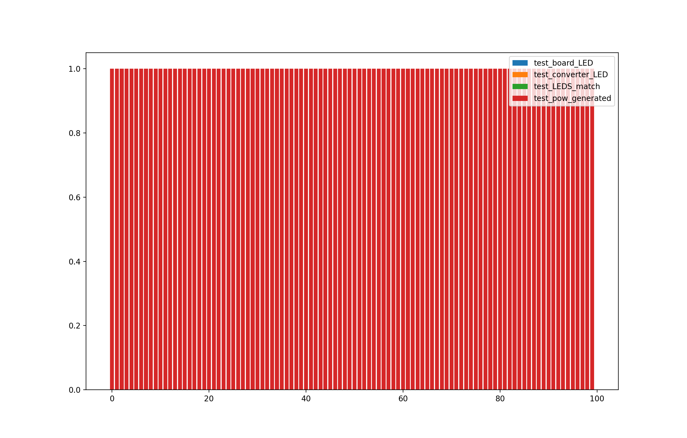
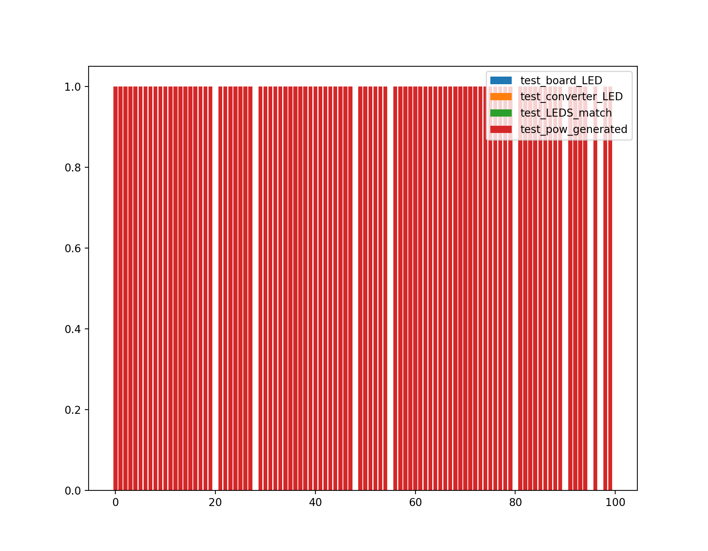
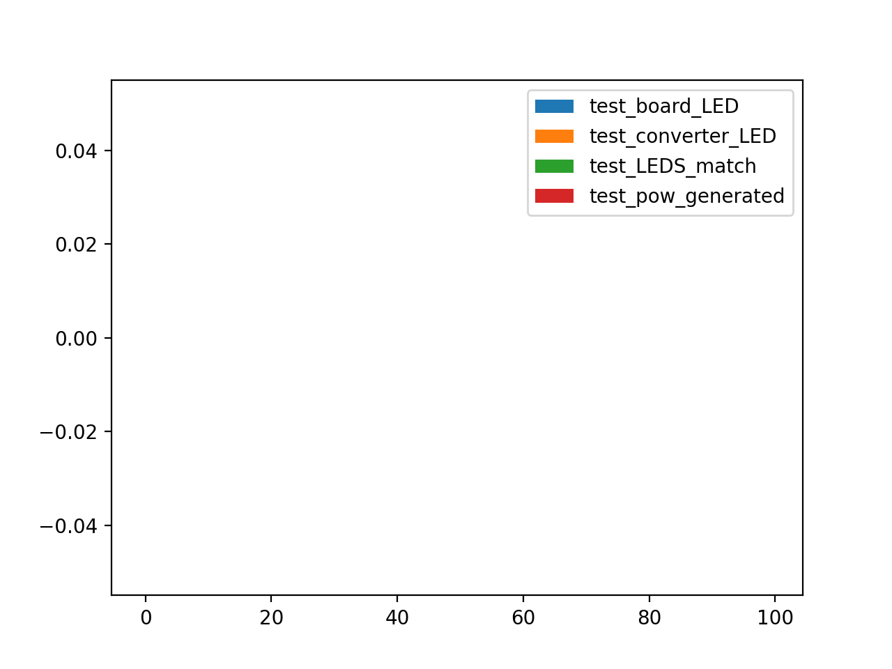

# Hydro Generator Presentation
## Summary
This code is meant to accompany the technical presentation on Hydro Generators. 

## Test Version: MVP
`pytest --junitxml="result.xml" --testver=0 --testround=1`
`pytest --junitxml="result.xml" --testver=0 --testround=2`

Specifically note failures like this:
`Failed: Power reading cannot be parsed`

## Test Version: 1
`pytest --junitxml="result.xml" --testver=1 --testround=1`
`pytest --junitxml="result.xml" --testver=1 --testround=2`
Note that the power generating failures are different based on the test round:

`0.02533117664907239 >= 20`

`assert 0.0 >= 20`

## Test Version: 2
`pytest --junitxml="result.xml" --testver=2 --testround=1`
`pytest --junitxml="result.xml" --testver=2 --testround=2`
These are now the only failures we're seeing:
`assert 0.02533117664907239 >= 20`

## Test Version: 3
`pytest --junitxml="result.xml" --testver=3 --testround=1`
`pytest --junitxml="result.xml" --testver=3 --testround=2`
No failures

## How to use this code
Install all dependencies using the requirements file. It is highly recommended to do this in a Python3 virtual environment.
### Check simulation
You can test that the simulation is working by running `pytest test_simulation.py`. Passing tests indicate that the simulation is behaving accurately.
### Check sample population
Run `pytest` by specifying `testver` and `testround`. This will create a new set of results for 100 Hydro Generators, for the specified test version and testing round.
You can see a graphical representation of results by running `python plotresults.py`, which will graph all errors found for each device.

